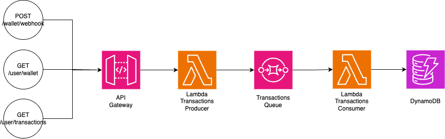

# Pre requisites
1. NodeJS > v18
2. AWS and SST account

# Steps
1. `npm install`
2. `cp .env.example .env`
3. `npx run dev`

# Diagram

---
# Future Improvements
1. Usage of transaction for db commits
2. Handling DLQs
3. Notification/Transaction consumer individual validation instead of whole array
    - currently if 1 fails, all fails
4. Handling transaction's pagination
    - currently returns all per user
5. Better initial dynamodb schema set-up
6. Unit tests, integration tests
---
# Running the App
1. Creating a user, manually inserting to dynamodb
```
{
 "id": "f5b8c1c7-2d7e-4c3f-a5c7-d25e2fc9205d",
 "amount": 0,
 "balance": 0,
 "createdAt": "2024-05-01T10:47:11.548Z",
 "gsi1": "user",
 "type": "user",
 "updatedAt": "2024-05-01T10:47:11.548Z"
}
```
---
2. Creating HMAC Signiture, in the root there is a file `signature-generator.js` that converts your payload to signature, 
replace the existing `messageData` with your payload, and attach to request header as `Authorization: HMAC_SHA256 {GENERATED_SIGNATURE}`

3. Calling the webhook, creating transactions, wallet
`POST {API_GATEWAY_URL}/wallet/webhook`
```
{
    "transactions": [
        {
            "id": "49f1cb10-0202-0138-225b-028e897a70a5",
            "created_at": "2019-12-16T07:19:14.966Z",
            "updated_at": "2019-12-16T07:19:14.968Z",
            "description": "Credit of $100.00 to Wallet Account by Debit of $100.00 from NPP Payin Funding Account",
            "type": "deposit",
            "type_method": "npp_payin",
            "state": "successful",
            "user_id": "f5b8c1c7-2d7e-4c3f-a5c7-d25e2fc9205d",
            "user_name": "Neol Buyer",
            "amount": "100.00",
            "currency": "AUD",
            "debit_credit": "credit"
        },
        {
            "id": "49f1cb10-0202-0138-225b-028e897a70a6",
            "created_at": "2019-12-16T07:19:14.966Z",
            "updated_at": "2019-12-16T07:19:14.968Z",
            "description": "Credit of $100.00 to Wallet Account by Debit of $100.00 from NPP Payin Funding Account",
            "type": "deposit",
            "type_method": "npp_payin",
            "state": "successful",
            "user_id": "f5b8c1c7-2d7e-4c3f-a5c7-d25e2fc9205d",
            "user_name": "Neol Buyer",
            "amount": "100.00",
            "currency": "AUD",
            "debit_credit": "credit"
        }
    ]
}
```
---
4. Getting user's wallet details `GET {API_GATEWAY_URL}/user/{USER_ID}/wallet`
```
// Sample Response
{
    "balance": 20000,
    "updatedAt": "2024-05-01T21:24:17.038Z",
    "createdAt": "2024-05-01T21:24:17.038Z",
    "amount": 0,
    "gsi1": "wallet",
    "id": "bca2c926-a0e0-4b02-9a74-34065b343eb2",
    "type": "wallet|f5b8c1c7-2d7e-4c3f-a5c7-d25e2fc9205d"
}
```
---
5. Getting user's transactions `GET {API_GATEWAY_URL}/user/{USER_ID}/transactions`
```
[
    {
        "currency": "AUD",
        "debit_credit": "credit",
        "type_method": "npp_payin",
        "createdAt": "2019-12-16T07:19:14.966Z",
        "gsi1": "payment-notification",
        "transactionType": "deposit",
        "state": "successful",
        "user_id": "f5b8c1c7-2d7e-4c3f-a5c7-d25e2fc9205d",
        "updatedAt": "2019-12-16T07:19:14.968Z",
        "amount": 10000,
        "description": "Credit of $100.00 to Wallet Account by Debit of $100.00 from NPP Payin Funding Account",
        "id": "1742379c-2cc2-4ee6-9114-9dced3ee9556",
        "user_name": "Neol Buyer",
        "type": "payment-notification|f5b8c1c7-2d7e-4c3f-a5c7-d25e2fc9205d"
    },
    {
        "currency": "AUD",
        "debit_credit": "credit",
        "type_method": "npp_payin",
        "createdAt": "2019-12-16T07:19:14.966Z",
        "gsi1": "payment-notification",
        "transactionType": "deposit",
        "state": "successful",
        "user_id": "f5b8c1c7-2d7e-4c3f-a5c7-d25e2fc9205d",
        "updatedAt": "2019-12-16T07:19:14.968Z",
        "amount": 10000,
        "description": "Credit of $100.00 to Wallet Account by Debit of $100.00 from NPP Payin Funding Account",
        "id": "ad516c20-c979-4c44-b5b2-f0634b7bb6be",
        "user_name": "Neol Buyer",
        "type": "payment-notification|f5b8c1c7-2d7e-4c3f-a5c7-d25e2fc9205d"
    }
]
```
